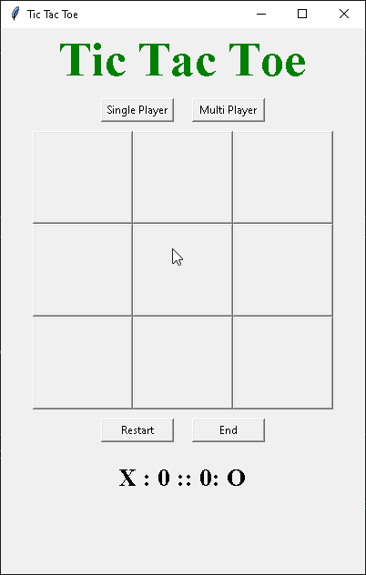
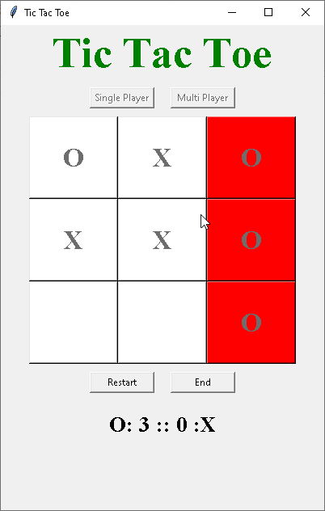
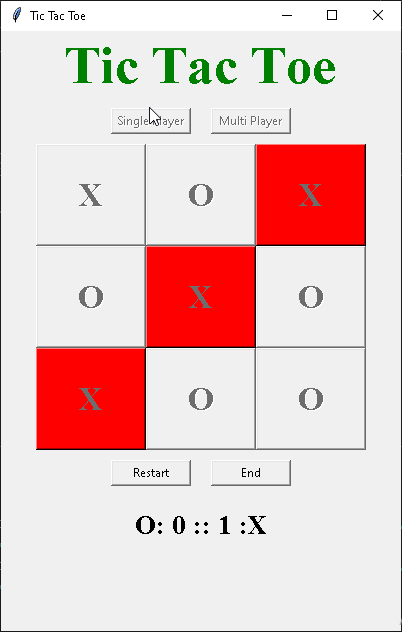

# Tic Tac Toe Game with Tkinter
This is a simple Tic-Tac-Toe game built using Python and Tkinter for the GUI. The game allows two players to take turns and play the classic game of Tic-Tac-Toe. The project demonstrates basic concepts of game development, GUI programming, and Python logic.

## Demo




Watch the full video tutorial on YouTube: [Tic-Tac-Toe Game with Tkinter](https://www.youtube.com/watch?v=0h63TJwyfYs&list=PLxSseczazYPyUKcKKot7yaWYegfJI5chb)

## Features
- Single-player mode (Player 'X' vs Computer 'O')
- Two-player mode (X vs O).
- Turn-based system with status display.
- Automatic win or draw detection.
- Reset button to start a new game after a match.

## Technologies Used
- Python
- Tkinter (for the graphical user interface)

## How to Run

1. **Clone the repository:**
   ```bash
   git clone https://github.com/Andrew-oduola/tic-tac-toe-with-python-tkinter
   ```

2. **Navigate to the project folder:**
   ```bash
   cd tic-tac-toe-tkinter
   ```

3. **Run the game:**
   ```bash
   python main.py
   ```

Make sure you have Python installed. This project requires no additional libraries apart from the built-in `tkinter` module.

## Game Rules
- The game is played on a 3x3 grid.
- Players take turns marking a square with either "X" or "O".
- The first player to get 3 of their marks in a row (vertically, horizontally, or diagonally) wins the game.
- If all 9 squares are filled and no player has 3 in a row, the game ends in a draw.
